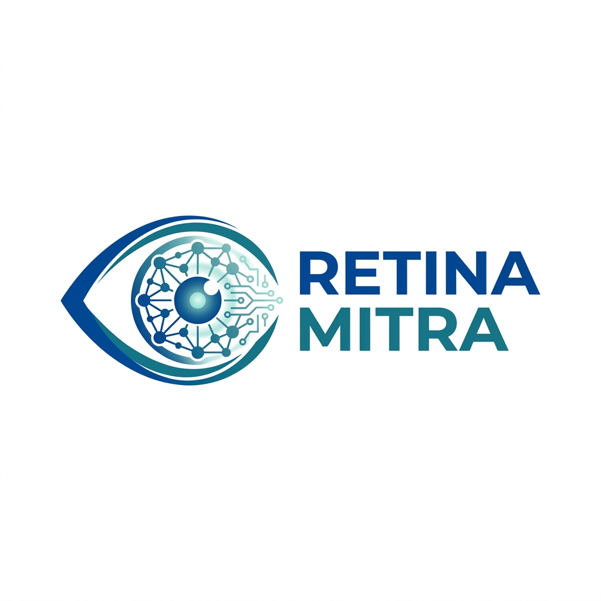
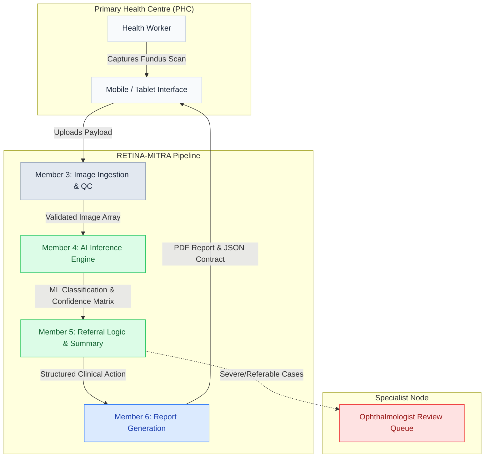
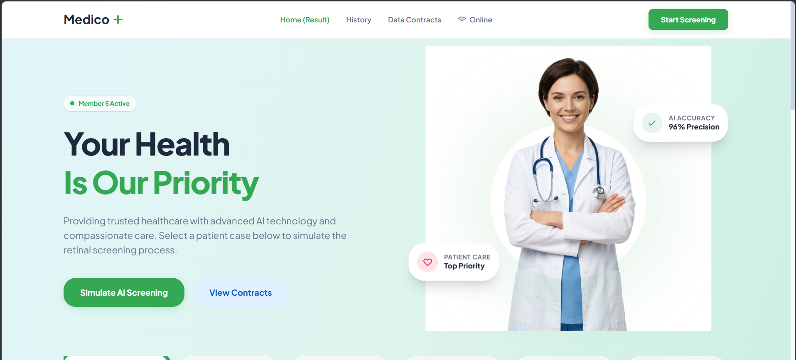
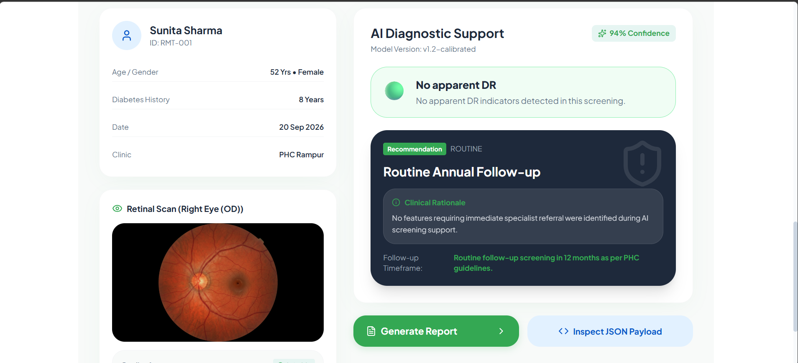

<div align="center">
  
  <h1>👁️ RETINA-MITRA</h1>
  <p><strong>AI-Powered Retinal Screening & Referral Support System</strong></p>
  
  [](https://react.dev/)
  [](https://vitejs.dev/)
  [](https://tailwindcss.com/)
  [](https://www.typescriptlang.org/)
</div>

<br />

**RETINA-MITRA** is a low-resource point-of-care screening tool designed specifically for Primary Health Centres (PHCs). By leveraging advanced machine learning inference pipelines, it provides instant, deterministic referral guidance for diabetic retinopathy and other retinal anomalies, acting as a crucial triage layer before specialist intervention.

---

## ✨ Core Capabilities

- 🤖 **Member 4 AI Inference**: Fast, reliable ML assessment of retinal fundus scans.
- 📊 **Member 5 Clinical Guidance**: Generates strict referral actions and rationale based on AI confidence scores and clinical thresholds.
- 📄 **Member 6 Hand-Off Reporting**: Structured JSON payload generation for secure clinical hand-offs and printable screening reports.
- 📱 **Mobile-First Ergonomics**: Highly responsive, swipe-friendly interface designed specifically for tablets and mobile devices used by field health workers.
- 📶 **Offline Resilience**: Asynchronous state management to handle intermittent or non-existent PHC network connectivity.

---

## 🏗️ System Architecture

The RETINA-MITRA application is modularly decoupled into specific "Members" that handle discrete responsibilities in the screening pipeline.



---

## 📸 Interface Preview

The interface has been meticulously crafted to feel professional, trustworthy, and heavily grounded in modern healthcare UX design paradigms.

### Desktop View (Dashboard & Results)


### Mobile View (Field Device Optimization)
<div align="center">
  
</div>

---

## 🚀 Getting Started

To spin up the RETINA-MITRA frontend development server locally:

### 1. Install Dependencies
```bash
npm install
```

### 2. Run the Development Server
```bash
npm run dev
```

### 3. Build for Production
```bash
npm run build
```

---

## 🔒 Data Contracts & JSON Payloads

RETINA-MITRA heavily relies on strictly typed TypeScript interfaces to ensure reliable data flow between the AI Inference module (Member 4) and the Reporting module (Member 6). 

You can inspect live JSON payloads directly within the application via the **Data Contracts Inspector** modal, which provides raw access to the exact schemas being passed through the pipeline.

---
<div align="center">
  <small>Built with ❤️ for better rural healthcare accessibility.</small>
</div>
